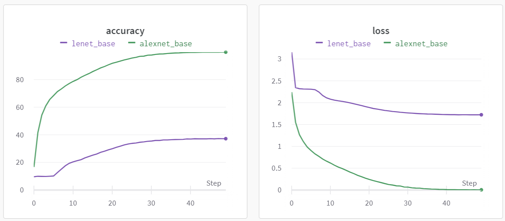
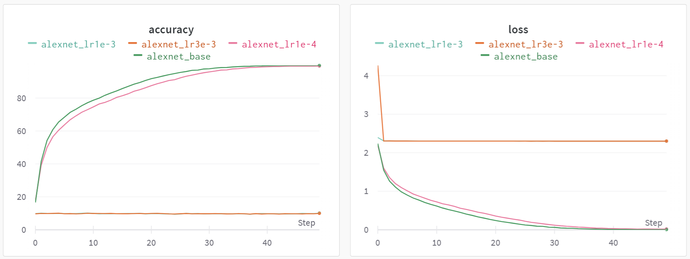
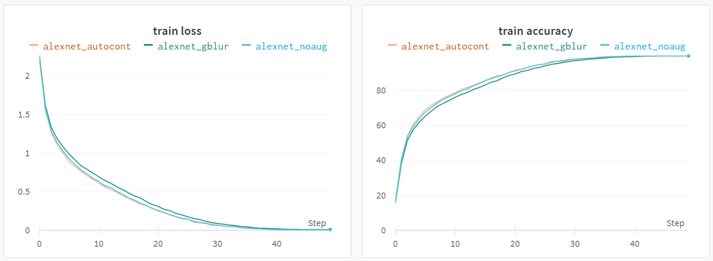
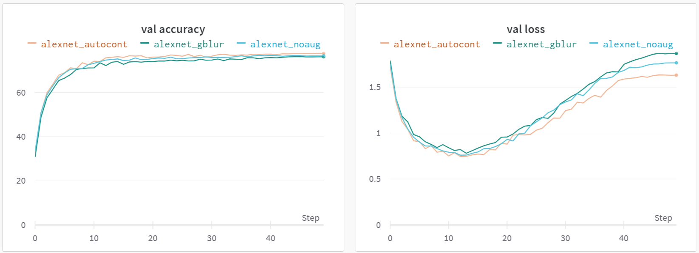

# HW 1 Worksheet

---

This is the worksheet for Homework 1. Your deliverables for this homework are:

- [ ] This worksheet with all answers filled in. If you include plots/images, be sure to include all the required files. Alternatively, you can export it as a PDF and it will be self-sufficient.
- [ ] Kaggle submission and writeup (details below)
- [ ] Github repo with all of your code! You need to either fork it or just copy the code over to your repo. A simple way of doing this is provided below. Include the link to your repo below. If you would like to make the repo private, please dm us and we'll send you the GitHub usernames to add as collaborators.

`https://github.com/ss1237/NMEP_sp23_HW1`

## To move to your own repo:

First follow `README.md` to clone the code. Additionally, create an empty repo on GitHub that you want to use for your code. Then run the following commands:

```bash
$ git remote rename origin staff # staff is now the provided repo
$ git remote add origin <your repos remote url>
$ git push -u origin main
```


# Part -1: PyTorch review

Feel free to ask your NMEP friends if you don't know!

## -1.0 What is the difference between `torch.nn.Module` and `torch.nn.functional`?

torch.nn.Module allows you to define arbitrary network architectures, while torch.nn.functional provides a library of stateless functions such as loss functions.

## -1.1 What is the difference between a Dataset and a DataLoader?

Dataset stores the samples and respective labels while Dataloader wraps an iterable around the Dataset so that we can access the Dataset.

## -1.2 What does `@torch.no_grad()` above a function header do?

It makes sure that any operations done on the function doesn't store gradients.


# Part 0: Understanding the codebase

Read through `README.md` and follow the steps to understand how the repo is structured.

## 0.0 What are the `build.py` files? Why do we have them?

It contains code used to build the model and dataloaders using the configs.

## 0.1 Where would you define a new model?

You would define it inside the models folder.

## 0.2 How would you add support for a new dataset? What files would you need to change?

To add a new dataset you would add code in `datasets.py`. After that you would need to also edit `build.py` to build the new dataset and use it.

## 0.3 Where is the actual training code?

The training code is in `main.py`.

## 0.4 Create a diagram explaining the structure of `main.py` and the entire code repo.

Be sure to include the 4 main functions in it (`main`, `train_one_epoch`, `validate`, `evaluate`) and how they interact with each other. Also explain where the other files are used. No need to dive too deep into any part of the code for now, the following parts will do deeper dives into each part of the code. For now, read the code just enough to understand how the pieces come together, not necessarily the specifics. You can use any tool to create the diagram (e.g. just explain it in nice markdown, draw it on paper and take a picture, use draw.io, excalidraw, etc.)


```mermaid
  graph TD;
      main-->train_one_epoch;
      main-->validate;
      main-->evaluate;
```

The `main` function calls the  `train_one_epoch` and `validate` functions repeatedly every epoch to get accuracies for training (updating the model) and validation (testing the current model on new data). After training the model, it calls the `evaludate` function to obtain predictions and eventually store them.

The entire repo is structured as follows:

```mermaid
  graph TD;
      root-->configs;
      root-->data;
      root-->models;
      root-->utils;
      root-->config.py;
      root-->main.py;
      root-->optimizer.py;
      configs-->.yaml_files;
      data-->data_build.py;
      data-->datasets.py;
      models-->models_build.py;
      models-->resnet.py;
      models-->lenet.py;
      utils-->__init__.py;
      utils-->load_save.py;
      utils-->logger.py;
```

The `\configs` folder contains various `.yaml` files that contain configurations for models that we may create. Inside `\data` is where we have files to load and process datasets. Inside `\models` is where we create and store our models. The `\utils` folder contains various python files that help when training our models. `main.py`, `config.py`, and `optimizer.py` all contain code that is used when training, both for the training loop and useful definitions that we use such as configurations and optimizers. There are also various `build.py` files that are used to handle the configs when calling another file inside the same folder.


# Part 1: Datasets

The following questions relate to `data/build.py` and `data/datasets.py`.

## 1.0 Builder/General

### 1.0.0 What does `build_loader` do?

`build_loader` creates Dataset objects from the datasets we want and then passes them into DataLoader objects for us to use.

### 1.0.1 What functions do you need to implement for a PyTorch Datset? (hint there are 3)

For a PyTorch Dataset, we need to implement the functions `__getitem__`, `__len__`, and `_get_transforms`.

## 1.1 CIFAR10Dataset

### 1.1.0 Go through the constructor. What field actually contains the data? Do we need to download it ahead of time?

The data is read into `self.file` using the h5py library. It uses the `filepath` field as its filepath, which means that we have to download the dataset ahead of time.

### 1.1.1 What is `self.train`? What is `self.transform`?

`self.train` is a boolean variables that tell the object whether the dataset is meant for training. `self.transform` is the transform that this dataset is going to do on the data, which is dependent on the value of `self.train`.

### 1.1.2 What does `__getitem__` do? What is `index`?

`__getitem__` gets an image and label from the dataset and returns it. `index` tells the function which item to return from the dataset.

### 1.1.3 What does `__len__` do?

`__len__` returns the length of the dataset.

### 1.1.4 What does `self._get_transforms` do? Why is there an if statement?

`self._get_transform` returns the transformation that needs to be used for the current dataset. If the dataset is meant for training, the if statement makes sure the transform augments the data with a rotation/color transform. If not, it simply normalizes the image.

### 1.1.5 What does `transforms.Normalize` do? What do the parameters mean? (hint: take a look here: https://pytorch.org/vision/main/generated/torchvision.transforms.Normalize.html)

`transforms.Normalize` normalizes the value of a tensor. Its first tuple contains the target means for each of the channels and the second tuple contains the target standard deviations.

## 1.2 MediumImagenetHDF5Dataset

### 1.2.0 Go through the constructor. What field actually contains the data? Where is the data actually stored on honeydew? What other files are stored in that folder on honeydew? How large are they?

The `self.file` field provides the data as we want to read it. The data is stored in the filepath `/data/medium-imagenet/medium-imagenet-nmep-96.hdf5`, and the other files are `medium-imagenet-nmep-96.hdf5` (50GB), `medium-imagenet-nmep-224.hdf5.old` (268GB), and some other smaller python files used for setup.

> *Some background*: HDF5 is a file format that stores data in a hierarchical structure. It is similar to a python dictionary. The files are binary and are generally really efficient to use. Additionally, `h5py.File()` does not actually read the entire file contents into memory. Instead, it only reads the data when you access it (as in `__getitem__`). You can learn more about [hdf5 here](https://portal.hdfgroup.org/display/HDF5/HDF5) and [h5py here](https://www.h5py.org/).

### 1.2.1 How is `_get_transforms` different from the one in CIFAR10Dataset?

This one divides every value by 256 since CIFAR10 is in black and white while MediumImageNet has RBG values which are much larger.

### 1.2.2 How is `__getitem__` different from the one in CIFAR10Dataset? How many data splits do we have now? Is it different from CIFAR10? Do we have labels/annotations for the test set?

This function checks whether the data is in train or test. If it is for the train set, it appends the label but for the test set it simply appends -1 as the label, which is different for CIFAR10.

### 1.2.3 Visualizing the dataset

Visualize ~10 or so examples from the dataset. There's many ways to do it - you can make a separate little script that loads the datasets and displays some images, or you can update the existing code to display the images where it's already easy to load them. In either case, you can use use `matplotlib` or `PIL` or `opencv` to display/save the images. Alternatively you can also use `torchvision.utils.make_grid` to display multiple images at once and use `torchvision.utils.save_image` to save the images to disk.

Be sure to also get the class names. You might notice that we don't have them loaded anywhere in the repo - feel free to fix it or just hack it together for now, the class names are in a file in the same folder as the hdf5 dataset.

By running the command `python visualize.py --cfg=configs/resnet18_medium_imagenet.yaml --vis=10`, we can sample 10 random images and store their files in `/output/resnet18`.

# Part 2: Models

The following questions relate to `models/build.py` and `models/models.py`.

## What models are implemented for you?

LeNet is implemented for us, and only part of ResNet is implemeneted.

## What do PyTorch models inherit from? What functions do we need to implement for a PyTorch Model? (hint there are 2)

PyTorch models inherit from `nn.Module` and we must always implement the `__init__()` and `forward()` functions.

## How many layers does our implementation of LeNet have? How many parameters does it have? (hint: to count the number of parameters, you might want to run the code)

Our implementation of LeNet has 7 layers and a total of 99.28K parameters.


# Part 3: Training

The following questions relate to `main.py`, and the configs in `configs/`.

## 3.0 What configs have we provided for you? What models and datasets do they train on?

The provided configs are for LeNet (which trains on CIFAR10) and ResNet (which trains on CIFAR10 and MediumImageNet).

## 3.1 Open `main.py` and go through `main()`. In bullet points, explain what the function does.

- Creates the datasets and model according to config
- Puts the model on the correct device
- Records and prints summary values
- Initializes the optimizer, loss, and learning rate scheduler
- Begins the training loop, which cycles between training and validation while periodically saving the model and printing out current information about the model
- Prints the total time and then runs the model on the test data

## 3.2 Go through `validate()` and `evaluate()`. What do they do? How are they different? 
> Could we have done better by reusing code? Yes. Yes we could have but we didn't... sorry...

The `validate()` function calculates the accuracy on the validation data set while the `evaluate()` function returns prediction values for the testing data set. They are different because of the data sets that they are evaluated on and the types of values they return.


# Part 4: AlexNet

## Implement AlexNet. Feel free to use the provided LeNet as a template. For convenience, here are the parameters for AlexNet:

```
Input NxNx3 # For CIFAR 10, you can set img_size to 70
Conv 11x11, 64 filters, stride 4, padding 2
MaxPool 3x3, stride 2
Conv 5x5, 192 filters, padding 2
MaxPool 3x3, stride 2
Conv 3x3, 384 filters, padding 1
Conv 3x3, 256 filters, padding 1
Conv 3x3, 256 filters, padding 1
MaxPool 3x3, stride 2
nn.AdaptiveAvgPool2d((6, 6)) # https://pytorch.org/docs/stable/generated/torch.nn.AdaptiveAvgPool2d.html
flatten into a vector of length x # what is x?
Dropout 0.5
Linear with 4096 output units
Dropout 0.5
Linear with 4096 output units
Linear with num_classes output units
```

> ReLU activation after every Conv and Linear layer. DO **NOT** Forget to add activatioons after every layer. Do not apply activation after the last layer.

## 4.1 How many parameters does AlexNet have? How does it compare to LeNet? With the same batch size, how much memory do LeNet and AlexNet take up while training? 
> (hint: use `gpuststat`)

AlexNet has 57.82M parameters compared to LeNet's 99.28K. With the same batch size, LeNet takes 23MB of memory while training compared to AlexNet's 1188MB.

## 4.2 Train AlexNet on CIFAR10. What accuracy do you get?

Report training and validation accuracy on AlexNet and LeNet. Report hyperparameters for both models (learning rate, batch size, optimizer, etc.). We get ~77% validation with AlexNet.

> You can just copy the config file, don't need to write it all out again.
> Also no need to tune the models much, you'll do it in the next part.

Training AlexNet on CIFAR10, we get a max accuracy of 76.85%.


# Part 5: Weights and Biases

> Parts 5 and 6 are independent. Feel free to attempt them in any order you want.

> Background on W&B. W&B is a tool for tracking experiments. You can set up experiments and track metrics, hyperparameters, and even images. It's really neat and we highly recommend it. You can learn more about it [here](https://wandb.ai/site).
> 
> For this HW you have to use W&B. The next couple parts should be fairly easy if you setup logging for configs (hyperparameters) and for loss/accuracy. For a quick tutorial on how to use it, check out [this quickstart](https://docs.wandb.ai/quickstart). We will also cover it at HW party at some point this week if you need help.

## 5.0 Setup plotting for training and validation accuracy and loss curves. Plot a point every epoch.

The code to use the wandb package is in the `main.py` file.

## 5.1 Plot the training and validation accuracy and loss curves for AlexNet and LeNet. Attach the plot and any observations you have below.



We see that our base AlexNet far outperforms our (not based) LeNet.

## 5.2 For just AlexNet, vary the learning rate by factors of 3ish or 10 (ie if it's 3e-4 also try 1e-4, 1e-3, 3e-3, etc) and plot all the loss plots on the same graph. What do you observe? What is the best learning rate? Try at least 4 different learning rates.



We see that our initial learning rate of 3e-4 performs the best, with 1e-4 slightly behind but still converging to the same loss and accuracy. The other two learning rates however flatline at a low accuracy/high loss and never really improve.

## 5.3 Do the same with batch size, keeping learning rate and everything else fixed. Ideally the batch size should be a power of 2, but try some odd batch sizes as well. What do you observe? Record training times and loss/accuracy plots for each batch size (should be easy with W&B). Try at least 4 different batch sizes.


We notice a general trend of larger batch sizes leading to worse accuracy and loss progressions, although they eventually converge to similar values (smaller batch sizes are still better).

## 5.4 As a followup to the previous question, we're going to explore the effect of batch size on _throughput_, which is the number of images/sec that our model can process. You can find this by taking the batch size and dividing by the time per epoch. Plot the throughput for batch sizes of powers of 2, i.e. 1, 2, 4, ..., until you reach CUDA OOM. What is the largest batch size you can support? What trends do you observe, and why might this be the case?
You only need to observe the training for ~ 5 epochs to average out the noise in training times; don't train to completion for this question! We're only asking about the time taken. If you're curious for a more in-depth explanation, feel free to read [this intro](https://horace.io/brrr_intro.html). 


We see that as we double the batch size the throughput approximately doubles, which means that the time per epoch remains about the same (which makes sense since we are processing the same number of samples). Once we reach a batch size of $2^{15}$ our GPU runs out of memory.

## 5.5 Try different data augmentations. Take a look [here](https://pytorch.org/vision/stable/transforms.html) for torchvision augmentations. Try at least 2 new augmentation schemes. Record loss/accuracy curves and best accuracies on validation/train set.




We tried adding two different augmentations: gaussian blur with a 3x3 kernel and random autocontrast with probability 0.3. Adding the blur made the network worse but the autocontrast resulted in a significant improvement in validation accuracy/loss.

## 5.6 (optional) Play around with more hyperparameters. I recommend playing around with the optimizer (Adam, SGD, RMSProp, etc), learning rate scheduler (constant, StepLR, ReduceLROnPlateau, etc), weight decay, dropout, activation functions (ReLU, Leaky ReLU, GELU, Swish, etc), etc.

Brain go brr no time gotta catch up to Tyler :)


# Part 6: ResNet

## 6.0 Implement and train ResNet18

In `models/models.py`, we provided some skelly/guiding comments to implement ResNet. Implement it and train it on CIFAR10. Report training and validation curves, hyperparameters, best validation accuracy, and training time as compared to AlexNet. 

`YOUR ANSWER HERE`

## 6.1 Visualize examples

Visualize a couple of the predictions on the validation set (20 or so). Be sure to include the ground truth label and the predicted label. You can use `wandb.log()` to log images or also just save them to disc any way you think is easy.

`YOUR ANSWER HERE`


# Part 7: Kaggle submission

To make this more fun, we have scraped an entire new dataset for you! 🎉

We called it MediumImageNet. It contains 1.5M training images, and 190k images for validation and test each. There are 200 classes distributed approximately evenly. The images are available in 224x224 and 96x96 in hdf5 files. The test set labels are not provided :). 

The dataset is downloaded onto honeydew at `/data/medium-imagenet`. Feel free to play around with the files and learn more about the dataset.

For the kaggle competition, you need to train on the 1.5M training images and submit predictions on the 190k test images. You may validate on the validation set but you may not use is as a training set to get better accuracy (aka don't backprop on it). The test set labels are not provided. You can submit up to 10 times a day (hint: that's a lot). The competition ends on __TBD__.

Your Kaggle scores should approximately match your validation scores. If they do not, something is wrong.

(Soon) when you run the training script, it will output a file called `submission.csv`. This is the file you need to submit to Kaggle. You're required to submit at least once. 

## Kaggle writeup

We don't expect anything fancy here. Just a brief summary of what you did, what worked, what didn't, and what you learned. If you want to include any plots, feel free to do so. That's brownie points. Feel free to write it below or attach it in a separate file.

**REQUIREMENT**: Everyone in your group must be able to explain what you did! Even if one person carries (I know, it happens) everyone must still be able to explain what's going on!

Now go play with the models and have some competitive fun! 🎉
